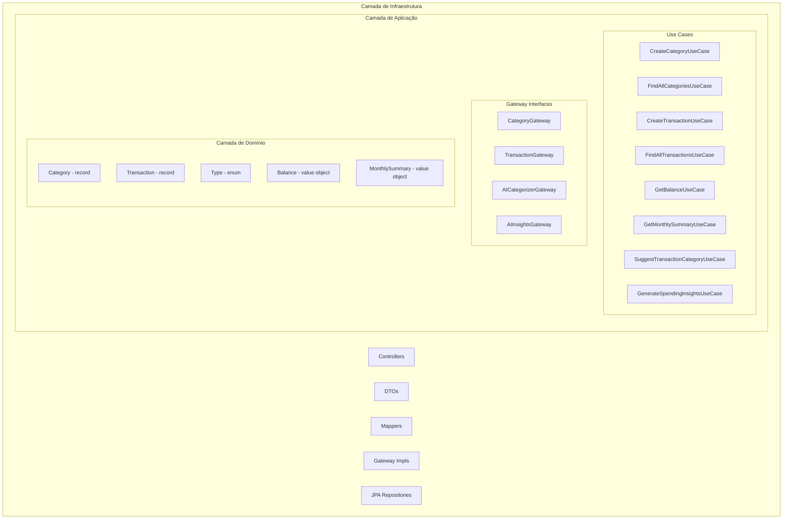
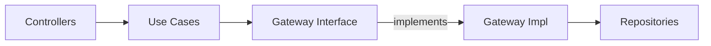
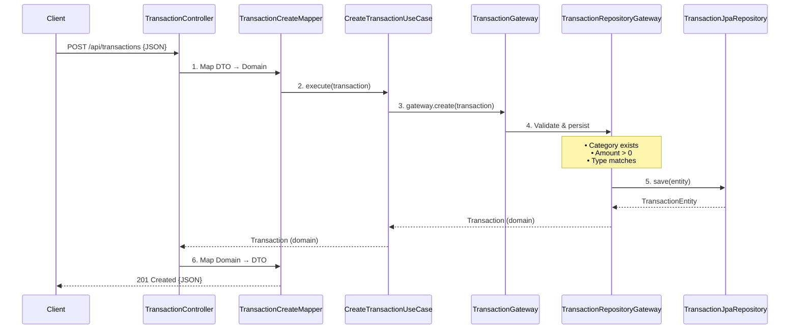
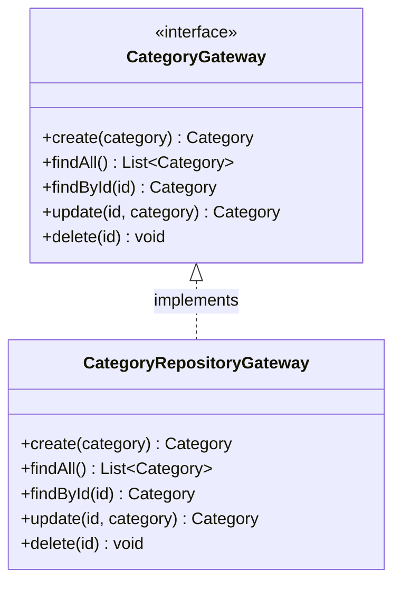
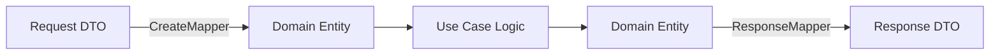
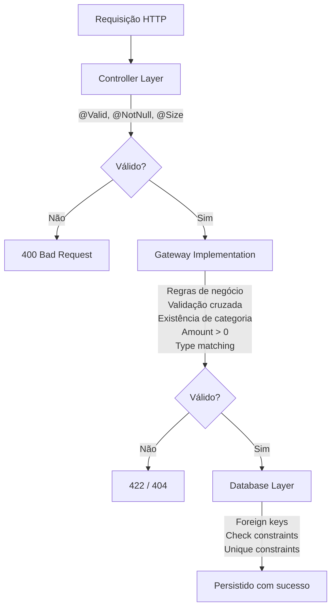

# Clean Architecture

## Visão Geral



**Princípio Central**: As dependências apontam para dentro. A camada de domínio tem **zero dependências externas**. A camada de aplicação depende apenas do domínio.

---

## Estrutura das Camadas

### Camada de Domínio

```
domain/
├── entities/           # Objetos de negócio imutáveis (records)
│   ├── Category
│   └── Transaction
├── enums/             # Enumerações de negócio
│   └── Type
└── valueobjects/      # Estruturas de dados imutáveis
    ├── Balance
    ├── CategorySuggestion
    ├── CategorySummary
    ├── MonthlySummary
    ├── SpendingInsights
    └── TransactionAnalysisData
```

### Camada de Aplicação

```
application/
├── gateway/           # Contratos de persistência e serviços (interfaces)
│   ├── CategoryGateway
│   ├── TransactionGateway
│   ├── AICategorizerGateway
│   └── AIInsightsGateway
└── usecases/          # Operações de negócio
    ├── category/
    │   ├── CreateCategoryUseCase
    │   ├── FindAllCategoriesUseCase
    │   ├── FindCategoryByIdUseCase
    │   ├── UpdateCategoryUseCase
    │   └── DeleteCategoryUseCase
    ├── transaction/
    │   ├── CreateTransactionUseCase
    │   ├── FindAllTransactionUseCase
    │   ├── FindTransactionByIdUseCase
    │   ├── UpdateTransactionUseCase
    │   ├── DeleteTransactionUseCase
    │   └── SuggestTransactionCategoryUseCase
    ├── summary/
    │   ├── GetBalanceUseCase
    │   ├── GetMonthlySummaryUseCase
    │   └── GetCategoriesSummaryUseCase
    └── insights/
        └── GenerateSpendingInsightsUseCase
```

### Camada de Infraestrutura

```
infra/
├── presentation/      # Controllers REST API
│   ├── CategoryController
│   ├── TransactionController
│   ├── SummaryController
│   ├── AIInsightsController
│   └── HealthController
├── dto/               # Objetos de Request/Response da API
│   ├── BalanceResponse
│   ├── CategoriesSummaryResponse
│   ├── CategoryCreateRequest
│   ├── CategoryResponse
│   ├── CategorySuggestionRequest
│   ├── CategorySuggestionResponse
│   ├── CategoryUpdateRequest
│   ├── ErrorResponse
│   ├── MonthlySummaryResponse
│   ├── SpendingInsightsRequest
│   ├── SpendingInsightsResponse
│   ├── TransactionCreateRequest
│   ├── TransactionResponse
│   └── TransactionUpdateRequest
├── mapper/            # Conversões de objetos
│   ├── BalanceResponseMapper
│   ├── CategoryCreateMapper
│   ├── CategoryEntityMapper
│   ├── CategoryResponseMapper
│   ├── CategorySuggestionMapper
│   ├── CategorySummaryResponseMapper
│   ├── CategoryUpdateRequestMapper
│   ├── MonthlySummaryResponseMapper
│   ├── SpendingInsightsMapper
│   ├── TransactionCreateMapper
│   ├── TransactionEntityMapper
│   ├── TransactionResponseMapper
│   └── TransactionUpdateRequestMapper
├── gateway/           # Implementações dos gateways
│   ├── CategoryRepositoryGateway
│   ├── TransactionRepositoryGateway
│   ├── GeminiCategorizerGateway
│   └── GeminiInsightsGateway
├── persistence/       # Entidades JPA e repositórios
│   ├── CategoryEntity
│   ├── CategoryRepository
│   ├── TransactionEntity
│   └── TransactionRepository
├── exception/         # Tratamento de exceções
│   ├── BudgetPlannerException (abstract)
│   ├── ResourceNotFoundException
│   ├── InvalidTransactionException
│   ├── AICategorizeException
│   ├── AIInsightsException
│   └── GlobalExceptionHandler
├── config/            # Configuração
│   └── AIProperties
├── util/              # Utilitários
│   ├── PeriodCalculator
│   └── DateRange
└── beans/             # Injeção de dependência
    └── BeanConfiguration
```

---

## Fluxo de Dependências



---

## Fluxo de uma Requisição

### Exemplo: Criando uma Transaction



---

## Relacionamento entre Componentes

### Padrão Use Case

```java
public class CreateCategoryUseCase {
    private final CategoryGateway gateway;

    public CreateCategoryUseCase(CategoryGateway gateway) {
        this.gateway = gateway;
    }

    public Category execute(Category category) {
        return gateway.create(category);
    }
}
```

**Características:**
- Responsabilidade única
- Método único `execute()`
- Depende da interface do gateway (não da implementação)
- Sem dependências de framework

### Padrão Gateway



### Fluxo dos Mappers



---

## Estratégia de Validação



---

## Decisões Arquiteturais

### 1. Camada de Aplicação Explícita
- Use cases e interfaces de gateway vivem em `application/`, separados do `domain/`
- O domínio permanece puro: apenas entities, enums e value objects
- Fronteira clara entre orquestração de lógica de negócio e regras centrais de negócio

### 2. Use Cases Sem Interfaces
- Simplificado do padrão interface + implementação
- Classes concretas são suficientes para operações de responsabilidade única
- Reduz boilerplate e complexidade

### 3. Padrão Gateway para Persistência
- A camada de aplicação define contratos via interfaces
- A infraestrutura fornece as implementações
- Permite testes com mocks
- Permite trocar estratégias de persistência

### 4. Validação nas Implementações de Gateway
- Regras de negócio aplicadas no nível do gateway
- Use cases permanecem simples e focados
- Ponto único de aplicação de lógica de negócio

### 5. Entidades Imutáveis
- Java records para entities, value objects e DTOs
- Previne mutação acidental de estado
- Thread-safe por design